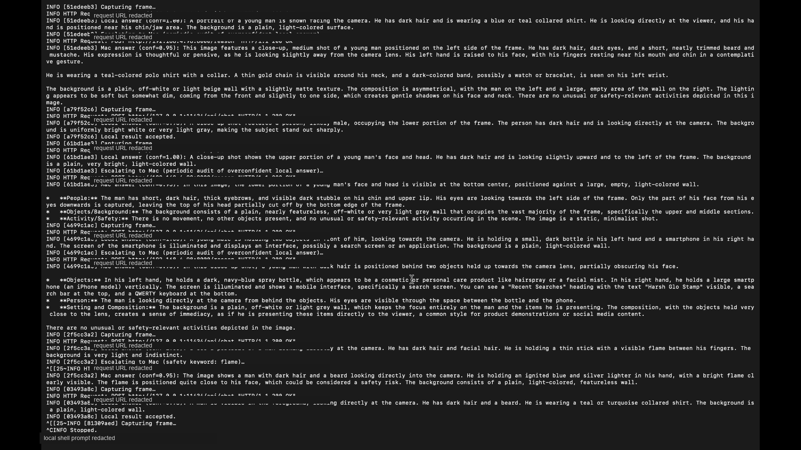
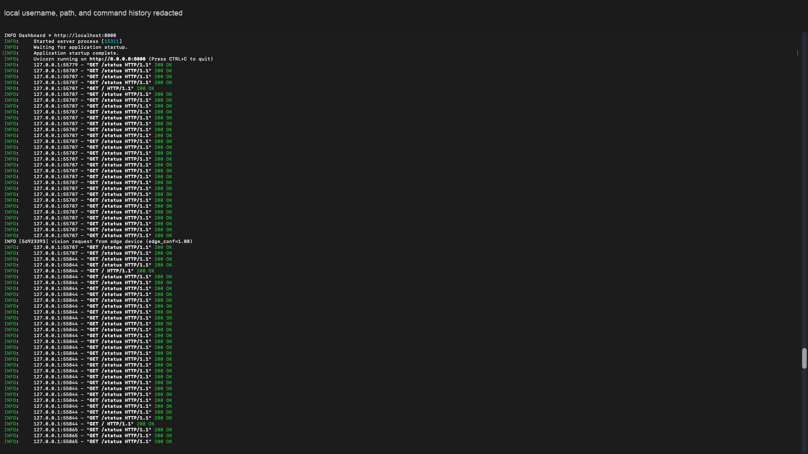
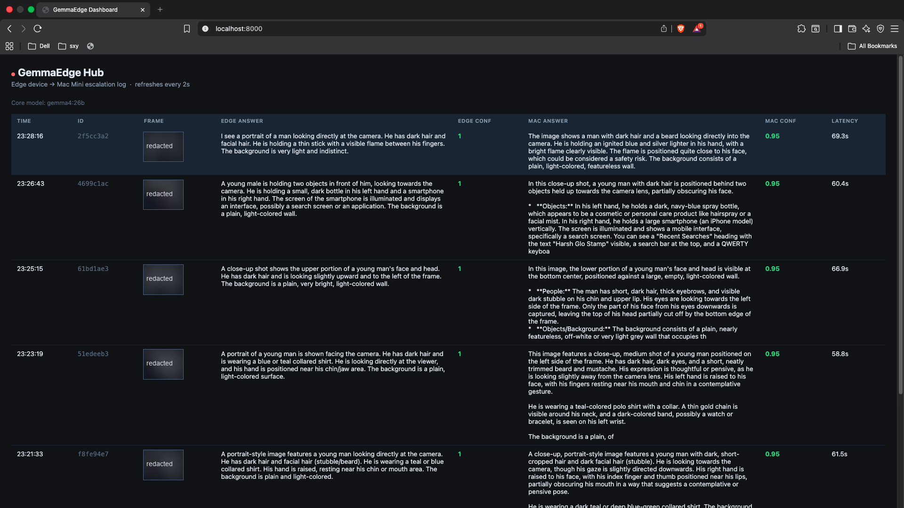

# GemmaEdge Hub

A two-device AI vision system built for the Dev.to Gemma 4 Challenge.

A MacBook Air runs **Gemma 4 2B** locally for fast, private inference. When confidence is low, it escalates the frame to a Mac Mini running **Gemma 4 26B** for deeper analysis. A live dashboard on the Mac Mini shows every escalation in real time.

---

## How it works

```
MacBook Air (edge)          Mac Mini (server)
──────────────────          ─────────────────
webcam → Gemma 4 2B    →   Gemma 4 26B
  routine frames: done        detailed answer
  uncertain/safety/audit →    dashboard log
```

- **Edge**: fast, private, no network needed for routine frames
- **Escalation**: uncertain frames, safety-relevant frames, and periodic audits leave the device
- **Teacher-student upskilling**: Mac Mini generates an optimized system prompt for the 2B model, improving local accuracy without any weight training

---

## Challenge fit

This is a **Build With Gemma 4** submission. It is designed around the judging criteria:

- **Intentional model use**: Gemma 4 2B runs on the edge for speed and privacy; Gemma 4 26B runs on the Mac Mini for deeper reasoning.
- **Technical implementation**: separate edge/server modules, shared protocol models, HTTP escalation, live dashboard, configurable audit policy, and prompt upskilling.
- **Originality**: a local two-device model-routing system instead of a single-model demo.
- **Usability**: a visible dashboard, clear setup instructions, documented run order, and lessons learned from real testing.

---

## Use cases

GemmaEdge Hub is useful anywhere a small local model should handle the common path, but a larger local model should review the important edge cases.

- **Home or small-office monitoring**: keep ordinary camera frames private on the edge device, but escalate possible smoke, fire, injury, or unusual activity.
- **Workshop and lab safety**: run lightweight visual checks near equipment, then ask the stronger model for a second opinion when something looks risky.
- **Accessibility assistance**: provide quick local scene descriptions while escalating ambiguous scenes for more careful reasoning.
- **Retail or front-desk awareness**: summarize routine activity locally and escalate unusual situations without streaming every frame to a cloud service.
- **Edge AI prototyping**: test hybrid model routing, confidence policies, and teacher-student prompt improvement without training custom model weights.

---

## Demo screenshots

The screenshots below are redacted demo captures from the local two-device run.







---

## Requirements

### Mac Mini (server)
- macOS with 24 GB unified RAM
- [Ollama](https://ollama.com) installed
- Python 3.9+

### MacBook Air (edge)
- macOS, Apple Silicon recommended
- [Ollama](https://ollama.com) installed
- Python 3.9+
- USB or built-in webcam

Both Macs must be on the same local network.

---

## Setup

### Mac Mini

```bash
# 1. Pull models
ollama pull gemma4:26b
ollama pull gemma4:e2b      # for local scoring in upskill_train.py

# 2. Install deps
cd gemmaedge-hub/mac
pip install -r requirements.txt

# 3. Start the server (dashboard at http://localhost:8000)
python3 server.py

# 4. Generate the optimized edge prompt (run once)
python3 upskill_train.py
# Copy the printed scp command and run it to push skill.txt to the Air
```

### MacBook Air

```bash
# 1. Enable Remote Login: System Settings → General → Sharing → Remote Login

# 2. On Mac Mini — copy project files over (replace IP with your Air's IP)
scp -r gemmaedge-hub prerak@<AIR_IP>:~/gemmaedge-hub

# 3. On MacBook Air
ollama pull gemma4:e2b

cd ~/gemmaedge-hub/air
pip install -r requirements.txt

# 4. Set Mac Mini IP and start
export MAC_URL=http://<MINI_IP>:8000
# Optional: audit every N overconfident local answers. Set 0 to disable.
export AUDIT_EVERY_N_FRAMES=3
cd ~/gemmaedge-hub
python3 air/sensor.py
```

Find your Mac's local IP:
```bash
ipconfig getifaddr en0
```

---

## Run order

1. **Mac Mini**: `python3 server.py`
2. **Mac Mini**: `python3 upskill_train.py` → copies skill.txt to Air
3. **MacBook Air**: `python3 air/sensor.py`
4. Open dashboard: `http://<MINI_IP>:8000`

---

## Models

| Device | Model | Size | Why |
|--------|-------|------|-----|
| MacBook Air | gemma4:e2b | ~3 GB | Fast local inference, fits 8 GB RAM |
| Mac Mini | gemma4:26b | ~18 GB | Deep reasoning, fits 24 GB RAM |

---

## Project structure

```
gemmaedge-hub/
  shared/
    protocol.py       # Pydantic message schema (edge ↔ Mac Mini)
  mac/
    server.py         # FastAPI server + live dashboard
    upskill_train.py  # Teacher-student prompt optimizer
    requirements.txt
  air/
    sensor.py         # Webcam capture + local inference + escalation
    client.py         # HTTP client to Mac Mini
    requirements.txt
```
